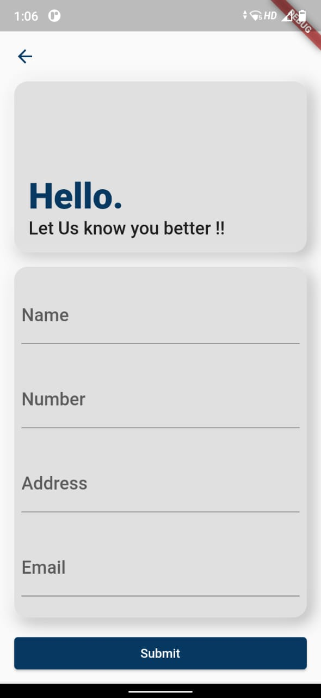

# Contact Form App

A simple Flutter application for managing contacts.

## Table of Contents

- [Introduction](#introduction)
- [Features](#features)
- [Project Structure](#project-structure)
- [Architecture](#architecture)
- [Data Flow](#data-flow)
- [Dependencies](#dependencies)
- [Screenshots](#screenshots)

## Introduction

The Contact Form App is a Flutter application that allows users to manage their contacts. It provides features for adding, viewing, and editing contacts. This project serves as an example of how to build a Flutter app with Firebase integration and a clean architecture pattern.

## Features

- Add new contacts with name, phone number, address, and email.
- View a list of all contacts.
- Firebase integration for data storage.
- Clean architecture with the Bloc pattern.

## Project Structure

The project follows a modular and organized structure:

- `lib`: Contains the Flutter application code.
  - `features`: Contains feature modules.
    - `contacts`: The contacts feature module.
      - `data`: Data sources, repositories, and models related to contacts.
      - `domain`: Use cases and entities related to contacts.
      - `presentation`: Blocs, events, and screens related to contacts.
  - `utils`: Utility functions and constants used throughout the app.
  - `main.dart`: The entry point of the application.

## Architecture

The Contact Form App follows the Clean Architecture pattern, which divides the codebase into distinct layers, each with a specific responsibility. Here's a high-level overview of the architecture:

### Presentation Layer

- **Screens and Widgets**: UI components and screens where user interactions occur.
- **Business Logic Components (BLoCs)**: Manage UI state and coordinate with the domain layer.
- **Events**: Triggered by user actions or other triggers.
- **States**: Represent the UI's current state and data.

### Domain Layer

- **Entities**: Plain Dart objects representing core business logic data.
- **Use Cases**: Application-specific business logic, defining how data should be processed.
- **Repositories**: Abstract interfaces that define how to interact with data sources.

### Data Layer

- **Data Sources**: Implement data retrieval and storage methods (e.g., Firebase).
- **Repositories**: Implementations connecting data sources to the domain layer.
- **Mapper**: Convert between data layer models and domain layer entities.

### External Services

- **Firebase**: Used as an external service for data storage (Firestore).

## Data Flow

1. User interacts with the UI, triggering events like "Add Contact" or "Load Contacts."

2. BLoCs process these events by invoking corresponding use cases from the domain layer.

3. Use cases execute business logic, which may include data validation or transformation.

4. Use cases interact with repositories to fetch or store data, depending on the operation.

5. Repositories delegate data retrieval and storage to data sources, communicating with external services (Firebase).

6. Data sources retrieve data from external services and provide it back to the repositories.

7. Data is transformed as needed and returned to the use cases in the domain layer.

8. Use cases return results to the BLoCs, which update the UI state.

9. UI components, such as widgets, respond to state changes and display updated data to the user.

This separation of concerns and data flow ensures a scalable, maintainable, and testable application architecture.

## Dependencies

The project uses the following major dependencies:

- Flutter: The framework for building the mobile app.
- Firebase: For cloud-based data storage.
- Bloc: For state management using the Bloc pattern.
- Get It: For dependency injection.
- Lottie: For animations.

## Screenshots

